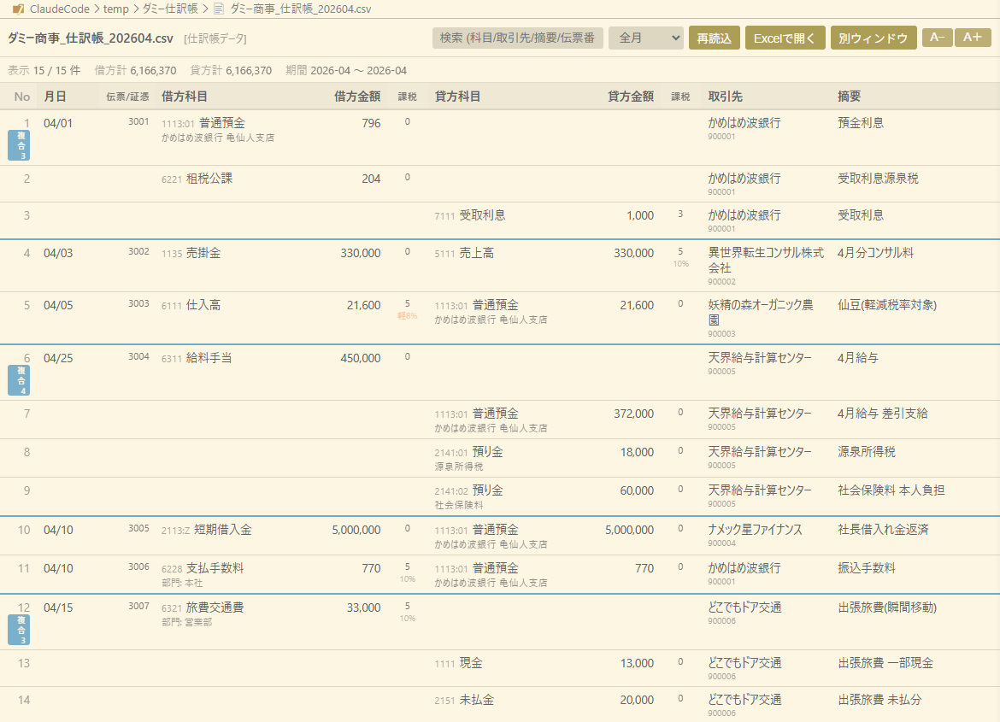

# TKC仕訳帳ビューアー (VSCode拡張)



TKC FX2（まいすたー）クラウドの仕訳データをVSCodeで見やすく表示します。
以下の形式に対応しています。
- 「仕訳帳」メニューから切り出せるcsvデータ
- 「仕訳帳(Excel)の読込」メニューにて切り出し／読み込みが出来るExcelデータ


## 使い方
- VSCodeの左側ファイルエクスプローラーにて、表示したいファイルを右クリック →「TKC仕訳帳ビューアーで開く」で仕訳帳ビューを表示
- 画面が狭いときは別ウィンドウで表示も可能
- AIが生成した記帳をチェックする際などにご活用ください

なお、この拡張ビューでは仕訳の編集はできません


## インストール

PowerShellで1行:

```powershell
irm https://raw.githubusercontent.com/ryobang/tkc-journal-viewer/main/install.ps1 | iex
```

最新リリースの .vsix を取得して `code --install-extension` で入れます。事前にVSCodeの `code` コマンドがPATHに通っている必要があります（`Ctrl+Shift+P` →「Shell Command: Install 'code' command in PATH」）。

手動で入れる場合:

```powershell
code --install-extension tkc-journal-viewer-0.1.13.vsix
```

## 設定

- `tkcJournal.dateFormat` — 日付の表示形式（`MM/DD` / `M/D` / `YYYY-MM-DD`）
- `tkcJournal.zeroAmount` — ゼロ金額の表示（`blank` / `zero` / `dash`）
- `tkcJournal.defaultFontSize` — ビューを開いたときの既定の文字サイズ(px, 9〜28)。画面右上の A−／A＋ で一時的に拡大縮小できます

## 制限

- 読み取り専用。仕訳の編集はできません（元のxlsx/csvが正本）
- xlsxは1ファイルにつき先頭シートのみ対象
- 数式セルは計算結果が無いと0として扱う場合あり

## ライセンス

MIT
